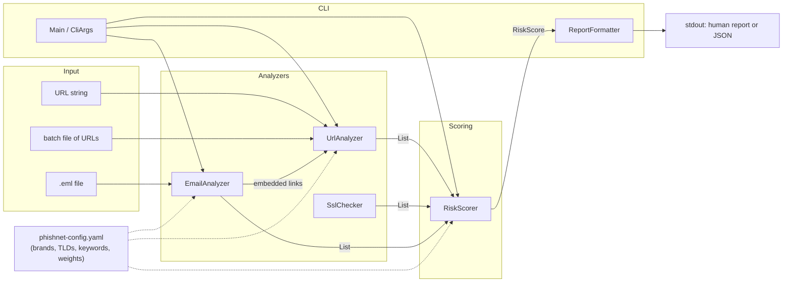

# PhishNet Detector

<p align="center">
  
</p>

A phishing detection tool written in Java. It inspects URLs, TLS certificates,
and `.eml` email files for a range of phishing indicators, then combines
whatever it finds into a single 0-100 risk score with a Low/Medium/High
label and a plain-language recommendation.

Everything that can be tuned - the brand list, suspicious TLDs, urgency
keywords, and scoring weights - lives in a YAML config file, not in the code.

## Contents

- [What it detects](#what-it-detects)
- [Architecture](#architecture)
- [How scoring works](#how-scoring-works)
- [Setup](#setup)
- [Usage](#usage)
- [Configuration](#configuration)
- [Testing](#testing)
- [Project layout](#project-layout)
- [License](#license)

## What it detects

**URLs** (`UrlAnalyzer`)

- Homograph / punycode attacks (e.g. Cyrillic look-alike characters spoofing `apple.com`)
- Typosquatting against a configurable brand list, via Levenshtein distance
  (`paypa1.com`), combosquatting (`paypal-secure-login.com`,
  `micros0ft-support.com`), and brand-as-subdomain abuse (`paypal.evil.com`)
- URL shorteners (`bit.ly`, `tinyurl.com`, ...) - flagged as elevated risk since they hide the real destination
- Suspicious/abused TLDs (`.tk`, `.ml`, `.ga`, ...), loaded from config
- IP-address-as-domain URLs (`http://192.168.1.1/login`)
- Abnormally long URLs, excessive query parameters, heavy percent-encoding, and nested/embedded redirect URLs

**TLS certificates** (`SslChecker`)

- No certificate presented at all
- Expired certificates
- Self-signed certificates
- Certificates not issued by a trusted CA

**Emails** (`EmailAnalyzer`, via Jakarta Mail)

- Urgency/threat language, in both English and Turkish (configurable keyword lists)
- Display-name vs. actual sender-address mismatches (spoofing)
- Reply-To/From domain mismatches
- Every embedded link, run back through `UrlAnalyzer`

## Architecture



Each analyzer only *describes what it found* as a list of `Signal` objects
(a stable id, a category, a human-readable description, and optional
evidence). None of them assign point values. `RiskScorer` is the single place
where signal ids are turned into points, summed, clamped to 0-100, and mapped
to a Low/Medium/High band - which is what makes it independently unit
testable and keeps "how risky is X" a one-line config change away from "what
does X look like."

Every analyzer and the scorer take their configuration via constructor
injection (`PhishNetConfig`), and none of them perform their own file or
network I/O internally beyond what their one job requires (`SslChecker`
opens a socket only inside `check()`; its actual decision logic lives in the
network-free `analyze()`; `EmailAnalyzer` and `UrlAnalyzer` operate on
already-supplied streams/strings). That's what lets the test suite exercise
all of the interesting logic with zero real sockets or filesystem access.

## How scoring works

1. Every analyzer run produces a `List<Signal>`, each with a stable id such
   as `homograph`, `typosquatting`, `suspiciousTld`, `sslExpired`,
   `urgencyLanguage`, `senderMismatch`, etc.
2. `RiskScorer` looks up each signal id's point value in
   `scoring.weights` in the config (falling back to 10 points for an
   unrecognized id) and sums them. The same id firing more than once (e.g.
   two risky links in one email) contributes its weight each time.
3. The total is clamped to the 0-100 range.
4. The clamped score is compared against `scoring.mediumThreshold` and
   `scoring.highThreshold` to produce a `RiskLevel` of `LOW`, `MEDIUM`, or
   `HIGH`.
5. A short recommendation string is attached based on the level.

Nothing about step 2-4 is hardcoded in Java - every weight and threshold
comes from `phishnet-config.yaml` (or a `--config` override), so retuning the
tool for a stricter or looser environment never requires a rebuild.

## Setup

Requirements: JDK 26+ and Maven 3.9+.

```bash
git clone <this repo>
cd phishnet-detector
mvn clean package
```

This produces a runnable, dependency-bundled jar at `target/phishnet.jar`.

## Usage

```bash
# Analyze a single URL
java -jar target/phishnet.jar --url "http://paypa1-secure-login.tk/verify?redirect=http://evil.tk/x"

# Analyze a single email
java -jar target/phishnet.jar --email suspicious-message.eml

# Analyze a newline-separated file of URLs ('#' lines are treated as comments)
java -jar target/phishnet.jar --batch urls.txt

# Machine-readable JSON output, for reporting/CI use
java -jar target/phishnet.jar --url "https://example.com" --json

# Use a custom config instead of the bundled defaults
java -jar target/phishnet.jar --url "https://example.com" --config my-config.yaml
```

### Sample output

```
$ java -jar target/phishnet.jar --url "http://paypa1-secure-login.tk/verify?redirect=http://evil.tk/x"
Target: http://paypa1-secure-login.tk/verify?redirect=http://evil.tk/x
Risk Score: 70/100 (HIGH)
Signals:
  - [suspiciousTld] URL uses a TLD commonly abused for phishing (.tk)
  - [typosquatting] Domain segment 'paypa1' closely resembles brand 'paypal' (edit distance 1) (paypa1-secure-login.tk)
  - [nestedRedirect] URL appears to embed another URL in its query string, a common open-redirect phishing pattern
Recommendation: High risk of phishing. Do not click any links, enter credentials, or open attachments. Report and delete.
```

```
$ java -jar target/phishnet.jar --url "https://www.google.com" --json
{
  "target" : "https://www.google.com",
  "score" : 0,
  "level" : "LOW",
  "recommendation" : "No strong phishing indicators found. Still verify anything requesting credentials or payment before acting on it.",
  "signals" : [ ]
}
```

```
$ java -jar target/phishnet.jar --batch urls.txt
...
Summary: 10 URL(s) analyzed - 0 high risk, 6 medium risk
```

## Configuration

`src/main/resources/phishnet-config.yaml` is bundled into the jar and used
by default. Pass `--config <path>` to override it with your own copy - the
schema is:

```yaml
brands: [google, paypal, apple, ...]        # brand names to defend against typosquatting/homograph attacks
suspiciousTlds: [tk, ml, ga, ...]           # TLDs treated as elevated risk
urlShorteners: [bit.ly, tinyurl.com, ...]   # link shorteners, flagged as elevated risk
urgencyKeywords:
  en: ["verify your account", ...]
  tr: ["hesabınızı doğrulayın", ...]
scoring:
  weights:
    homograph: 35
    typosquatting: 30
    # ... one entry per signal id
  mediumThreshold: 30      # score >= this is MEDIUM
  highThreshold: 60        # score >= this is HIGH
  typosquattingMaxDistance: 2
  longUrlThreshold: 75
  maxQueryParams: 8
  encodedCharThreshold: 5
```

## Testing

```bash
mvn test
```

JUnit 5 tests cover every module (parsing edge cases, internationalized
domain names, malformed/empty input, missing email headers, scoring
boundaries, CLI argument handling) with a mix of hand-built cases and
real-world-style fixtures under `src/test/resources/{urls,emails}`. A JaCoCo
report is generated at `target/site/jacoco/index.html` after `mvn test`.

## Project layout

```
src/main/java/com/phishnet/
  analyzer/   UrlAnalyzer, SslChecker, EmailAnalyzer
  model/      Signal, RiskScore, UrlComponents, PhishNetConfig, ...
  scoring/    RiskScorer
  cli/        Main, CliArgs, ReportFormatter
  util/       LevenshteinDistance, HomoglyphUtil, ConfigLoader
src/main/resources/phishnet-config.yaml
src/test/java/...            (mirrors the layout above)
src/test/resources/urls/     phishing_urls.txt, legitimate_urls.txt
src/test/resources/emails/   .eml fixtures (phishing and legitimate)
```

## License

MIT - see [LICENSE](LICENSE). Copyright (c) 2026 Kadim Birhan.

<p align="center"><em>-by Deipedra</em></p>
