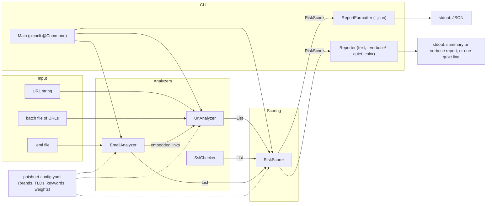

# PhishNet Detector

<p align="center">
  
</p>

A phishing detection tool written in Java. It inspects URLs, TLS certificates,
and `.eml` email files for a range of phishing indicators, then combines
whatever it finds into a single 0-100 risk score with a Low/Medium/High
label and a plain-language recommendation.

Everything that can be tuned - the brand list, suspicious TLDs, urgency
keywords, and scoring weights - lives in a YAML config file, not in the code.

## Contents

- [What it detects](#what-it-detects)
- [Architecture](#architecture)
- [How scoring works](#how-scoring-works)
- [Setup](#setup)
- [Usage](#usage)
- [Configuration](#configuration)
- [Testing](#testing)
- [Project layout](#project-layout)
- [Contributing](#contributing)
- [License](#license)

## What it detects

**URLs** (`UrlAnalyzer`)

- Homograph / punycode attacks (e.g. Cyrillic look-alike characters spoofing `apple.com`)
- Typosquatting against a configurable brand list, via Levenshtein distance
  (`paypa1.com`), combosquatting (`paypal-secure-login.com`,
  `micros0ft-support.com`), and brand-as-subdomain abuse (`paypal.evil.com`)
- URL shorteners (`bit.ly`, `tinyurl.com`, ...) - flagged as elevated risk since they hide the real destination
- Suspicious/abused TLDs (`.tk`, `.ml`, `.ga`, ...), loaded from config
- IP-address-as-domain URLs (`http://192.168.1.1/login`)
- Abnormally long URLs, excessive query parameters, heavy percent-encoding, and nested/embedded redirect URLs

**TLS certificates** (`SslChecker`)

- No certificate presented at all
- Expired certificates
- Self-signed certificates
- Certificates not issued by a trusted CA

**Emails** (`EmailAnalyzer`, via Jakarta Mail)

- Urgency/threat language, in both English and Turkish (configurable keyword lists)
- Display-name vs. actual sender-address mismatches (spoofing)
- Reply-To/From domain mismatches
- Every embedded link, run back through `UrlAnalyzer`

## Architecture



Each analyzer only *describes what it found* as a list of `Signal` objects
(a stable id, a category, a human-readable description, and optional
evidence). None of them assign point values. `RiskScorer` is the single place
where signal ids are turned into points, summed, clamped to 0-100, and mapped
to a Low/Medium/High band - which is what makes it independently unit
testable and keeps "how risky is X" a one-line config change away from "what
does X look like."

Every analyzer and the scorer take their configuration via constructor
injection (`PhishNetConfig`), and none of them perform their own file or
network I/O internally beyond what their one job requires (`SslChecker`
opens a socket only inside `check()`; its actual decision logic lives in the
network-free `analyze()`; `EmailAnalyzer` and `UrlAnalyzer` operate on
already-supplied streams/strings). That's what lets the test suite exercise
all of the interesting logic with zero real sockets or filesystem access.

## How scoring works

1. Every analyzer run produces a `List<Signal>`, each with a stable id such
   as `homograph`, `typosquatting`, `suspiciousTld`, `sslExpired`,
   `urgencyLanguage`, `senderMismatch`, etc.
2. `RiskScorer` looks up each signal id's point value in
   `scoring.weights` in the config (falling back to 10 points for an
   unrecognized id) and sums them. The same id firing more than once (e.g.
   two risky links in one email) contributes its weight each time.
3. The total is clamped to the 0-100 range.
4. The clamped score is compared against `scoring.mediumThreshold` and
   `scoring.highThreshold` to produce a `RiskLevel` of `LOW`, `MEDIUM`, or
   `HIGH`.
5. A short recommendation string is attached based on the level.

Nothing about step 2-4 is hardcoded in Java - every weight and threshold
comes from `phishnet-config.yaml` (or a `--config` override), so retuning the
tool for a stricter or looser environment never requires a rebuild.

## Setup

Requirements: JDK 26+ and Maven 3.9+.

```bash
git clone <this repo>
cd phishnet-detector
mvn clean package
```

This produces a runnable, dependency-bundled jar at `target/phishnet.jar`.

## Usage

The CLI is built on [picocli](https://picocli.info), which generates `--help`
and `--version` output directly from the `@Command`/`@Option` annotations on
[`Main`](src/main/java/com/phishnet/cli/Main.java) - so this is always exactly
what you get by running it yourself:

```
$ java -jar target/phishnet.jar --help
Usage:
phishnet [-hV] [--config=<path>] (--url=<url> | --email=<file.eml> |
         --batch=<file>) [[--json] [--no-color]] [-v | -q]

Analyzes URLs, TLS certificates, and .eml email files for phishing indicators,
and combines whatever it finds into a single 0-100 risk score with a
Low/Medium/High label and a plain-language recommendation.

Options:
      --config=<path>      Use a custom YAML config instead of the bundled
                             default
  -h, --help               Show this help message and exit.
  -V, --version            Print version information and exit.

Input options:
      --url=<url>          Analyze a single URL
      --email=<file.eml>   Analyze a single .eml email file
      --batch=<file>       Analyze a newline-separated file of URLs ('#'
                             comments allowed)

Output options:
      --json               Output machine-readable JSON instead of a
                             human-readable report
      --no-color           Disable ANSI colors even if the terminal supports
                             them

  -v, --verbose            Show each analyzer's internal reasoning, not just
                             the summary
  -q, --quiet              Print one machine-parsable line only (LEVEL SCORE
                             TARGET); exit code reflects risk

Examples:
  phishnet --url https://example.com
  phishnet --email suspicious.eml --verbose
  phishnet --batch urls.txt --json

See the project README for the full option reference and sample output.
```

```
$ java -jar target/phishnet.jar --version
phishnet 1.0.0
```

`--version` always reflects the version actually built (Maven filters it into
`version.properties` at build time from the `pom.xml` `<version>`), so it can
never drift out of sync with a release.

Exit codes: `0` for a completed LOW/MEDIUM-risk (or non-quiet) run, `1` for a
completed HIGH-risk run in `--quiet` mode or an I/O error (missing file,
unreadable config), and picocli's own usage-error code (`2`) for bad
arguments - an unknown flag, a missing required value, no (or more than one)
of `--url`/`--email`/`--batch`, or passing both `--verbose` and `--quiet`.

```bash
# Analyze a single URL
java -jar target/phishnet.jar --url "http://paypa1-secure-login.tk/verify?redirect=http://evil.tk/x"

# Analyze a single email
java -jar target/phishnet.jar --email suspicious-message.eml

# Analyze a newline-separated file of URLs ('#' lines are treated as comments)
java -jar target/phishnet.jar --batch urls.txt

# Show each analyzer's internal reasoning (parsed URL/email details), not just the summary
java -jar target/phishnet.jar --url "http://paypa1-secure-login.tk/verify" --verbose

# One machine-parsable line only ("LEVEL SCORE TARGET") - good for piping into other tools.
# Exit code reflects risk too: 1 for HIGH, 0 otherwise, so it's scriptable.
java -jar target/phishnet.jar --url "http://paypa1-secure-login.tk/verify" --quiet

# Machine-readable JSON output, for reporting/CI use
java -jar target/phishnet.jar --url "https://example.com" --json

# Force plain output even on a color-capable terminal
java -jar target/phishnet.jar --url "https://example.com" --no-color

# Use a custom config instead of the bundled defaults
java -jar target/phishnet.jar --url "https://example.com" --config my-config.yaml
```

Output is colored automatically when stdout is a real terminal (HIGH=red, MEDIUM=yellow, LOW=green,
bold labels, ⚠/✓/✗ symbols). Colors are skipped automatically when output is piped or redirected to
a file, and can be turned off explicitly with `--no-color` or by setting the `NO_COLOR` environment
variable ([no-color.org](https://no-color.org/)). `--quiet` output never includes color, since it's
meant to be machine-parsable.

### Sample output

```
$ java -jar target/phishnet.jar --url "http://paypa1-secure-login.tk/verify?redirect=http://evil.tk/x"
Target: http://paypa1-secure-login.tk/verify?redirect=http://evil.tk/x
Risk Score: 70/100 (HIGH)
Signals:
  ✗ [suspiciousTld] URL uses a TLD commonly abused for phishing
  ✗ [typosquatting] Domain segment 'paypa1' closely resembles brand 'paypal' (edit distance 1)
  ✗ [nestedRedirect] URL appears to embed another URL in its query string, a common open-redirect phishing pattern
Recommendation: High risk of phishing. Do not click any links, enter credentials, or open attachments. Report and delete.
```

```
$ java -jar target/phishnet.jar --url "http://paypa1-secure-login.tk/verify" --verbose
Target: http://paypa1-secure-login.tk/verify
Risk Score: 55/100 (MEDIUM)
Signals:
  ⚠ [suspiciousTld] URL uses a TLD commonly abused for phishing (.tk)
  ⚠ [typosquatting] Domain segment 'paypa1' closely resembles brand 'paypal' (edit distance 1) (paypa1-secure-login.tk)
Recommendation: Some phishing indicators found. Proceed with caution: verify the sender/domain through a separate trusted channel before interacting.
Details:
  scheme=http, host=paypa1-secure-login.tk, subdomain=, domain=paypa1-secure-login, tld=tk, ip=false
  path=/verify, query params=0
```

```
$ java -jar target/phishnet.jar --url "http://paypa1-secure-login.tk/verify?redirect=http://evil.tk/x" --quiet
HIGH 70 http://paypa1-secure-login.tk/verify?redirect=http://evil.tk/x
$ echo $?
1
```

```
$ java -jar target/phishnet.jar --url "https://www.google.com" --json
{
  "target" : "https://www.google.com",
  "score" : 0,
  "level" : "LOW",
  "recommendation" : "No strong phishing indicators found. Still verify anything requesting credentials or payment before acting on it.",
  "signals" : [ ]
}
```

```
$ java -jar target/phishnet.jar --batch urls.txt
...
Summary: 10 URL(s) analyzed - 0 high risk, 6 medium risk
```

## Configuration

`src/main/resources/phishnet-config.yaml` is bundled into the jar and used
by default. Pass `--config <path>` to override it with your own copy - the
schema is:

```yaml
brands: [google, paypal, apple, ...]        # brand names to defend against typosquatting/homograph attacks
suspiciousTlds: [tk, ml, ga, ...]           # TLDs treated as elevated risk
urlShorteners: [bit.ly, tinyurl.com, ...]   # link shorteners, flagged as elevated risk
urgencyKeywords:
  en: ["verify your account", ...]
  tr: ["hesabınızı doğrulayın", ...]
scoring:
  weights:
    homograph: 35
    typosquatting: 30
    # ... one entry per signal id
  mediumThreshold: 30      # score >= this is MEDIUM
  highThreshold: 60        # score >= this is HIGH
  typosquattingMaxDistance: 2
  longUrlThreshold: 75
  maxQueryParams: 8
  encodedCharThreshold: 5
```

## Testing

```bash
mvn test
```

JUnit 5 tests cover every module (parsing edge cases, internationalized
domain names, malformed/empty input, missing email headers, scoring
boundaries, CLI argument handling) with a mix of hand-built cases and
real-world-style fixtures under `src/test/resources/{urls,emails}`. A JaCoCo
report is generated at `target/site/jacoco/index.html` after `mvn test`.

## Project layout

```
src/main/java/com/phishnet/
  analyzer/   UrlAnalyzer, SslChecker, EmailAnalyzer
  model/      Signal, RiskScore, UrlComponents, PhishNetConfig, ...
  scoring/    RiskScorer
  cli/        Main (picocli @Command), ReportFormatter, Reporter, OutputLevel
  util/       LevenshteinDistance, HomoglyphUtil, ConfigLoader, AnsiColor, ColorSupport
src/main/resources/phishnet-config.yaml
src/main/resources/version.properties  (Maven-filtered; feeds --version, see Contributing)
src/test/java/...            (mirrors the layout above)
src/test/resources/urls/     phishing_urls.txt, legitimate_urls.txt
src/test/resources/emails/   .eml fixtures (phishing and legitimate)
```

## Contributing

The CLI's argument parsing lives entirely in
[`Main`](src/main/java/com/phishnet/cli/Main.java) as
[picocli](https://picocli.info) `@Command`/`@Option`/`@ArgGroup` annotations -
there's no hand-rolled parsing to touch. To add a new flag:

1. Add a `@Option`-annotated field (or a `@Parameters` field for a positional
   argument) to `Main`, or to one of its nested option-holder classes
   (`ModeOptions`, `OutputOptions`, `VerbosityOptions`) if it belongs with an
   existing group. Give it a clear `description` - that text becomes the
   `--help` line, and requirement 4/6 in this repo's own history is "the help
   output should stay well-organized," so group new flags with the section
   they logically belong to (input/output/misc) rather than leaving them to
   fall into the default `Options:` bucket.
2. If the new flag must not be combined with an existing one (like
   `--verbose`/`--quiet`), use an `@ArgGroup` with `exclusive = true` rather
   than a manual `if` check - see the existing groups for the pattern, and
   note the caveat in the comment above the `mode` field about required
   groups needing to live at the top level, not nested inside an optional one.
3. Read the new field in `Main.call()` and wire it into the existing
   `runUrl`/`runEmail`/`runBatch` flow (or add a new one, following the same
   shape: take a `PrintStream`, return an exit code, never call
   `System.exit`).
4. Add a test in `MainTest` that drives it through `Main.run(args, out, err)`
   (which internally goes through picocli's `CommandLine#execute`) and
   asserts on the exit code and captured output - not a subprocess test.
5. Re-paste the `--help` output in this README's Usage section (`java -jar
   target/phishnet.jar --help`) so it stays in sync with what `Main` actually
   generates.

The `--version` string is never hand-typed: it's read at runtime from
`src/main/resources/version.properties`, which Maven filters at build time
(see the `<resources>` block in `pom.xml`) to substitute the real
`${project.version}` from `pom.xml`. Bump the version in one place (the
`pom.xml` `<version>`) and `--version` follows automatically.

## License

MIT - see [LICENSE](LICENSE). Copyright (c) 2026 Kadim Birhan.

<p align="center"><em>-by Deipedra</em></p>
