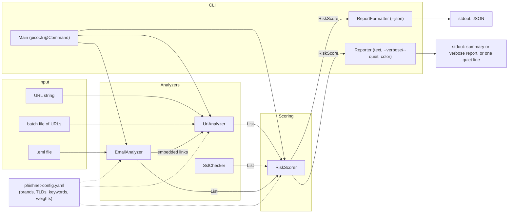

# PhishNet Detector

[](https://github.com/Deipedra34/PhishNet-Detector/actions/workflows/ci.yml)

<p align="center">
  
</p>

A phishing detection tool written in Java. It inspects URLs, TLS certificates,
and `.eml` email files for a range of phishing indicators, then combines
whatever it finds into a single 0-100 risk score with a Low/Medium/High
label and a plain-language recommendation.

Everything that can be tuned - the brand list, suspicious TLDs, urgency
keywords, and scoring weights - lives in a YAML config file, not in the code.

It runs as a command-line tool by default, and can optionally run as a small
JSON REST API server (`phishnet serve`) exposing the same URL and email
scanning over HTTP - see [REST API (serve mode)](#rest-api-serve-mode).

## Contents

- [What it detects](#what-it-detects)
- [Architecture](#architecture)
- [How scoring works](#how-scoring-works)
- [Setup](#setup)
- [Usage](#usage)
- [REST API (serve mode)](#rest-api-serve-mode)
- [Configuration](#configuration)
- [Testing](#testing)
- [Project layout](#project-layout)
- [Contributing](#contributing)
- [License](#license)

## What it detects

**URLs** (`UrlAnalyzer`)

- Homograph / punycode attacks (e.g. Cyrillic look-alike characters spoofing `apple.com`)
- Typosquatting against a configurable brand list, via Levenshtein distance
  (`paypa1.com`), combosquatting (`paypal-secure-login.com`,
  `micros0ft-support.com`), and brand-as-subdomain abuse (`paypal.evil.com`)
- URL shorteners (`bit.ly`, `tinyurl.com`, ...) - flagged as elevated risk since they hide the real destination
- Suspicious/abused TLDs (`.tk`, `.ml`, `.ga`, ...), loaded from config
- IP-address-as-domain URLs (`http://192.168.1.1/login`)
- Abnormally long URLs, excessive query parameters, heavy percent-encoding, and nested/embedded redirect URLs

**Domain age** (`DomainAgeChecker`, live WHOIS - disable with `--no-whois`)

- Newly registered domains (under 30 days) and relatively new ones (30-180
  days), via a real-time WHOIS lookup of the URL's registrable domain -
  throwaway phishing domains are typically only days or weeks old
- Well-established domains (over 180 days) get a small score reduction

**TLS certificates** (`SslChecker`)

- No certificate presented at all
- Expired certificates
- Self-signed certificates
- Certificates not issued by a trusted CA

**Emails** (`EmailAnalyzer`, via Jakarta Mail)

- Urgency/threat language, in both English and Turkish (configurable keyword lists)
- Display-name vs. actual sender-address mismatches (spoofing)
- Reply-To/From domain mismatches
- Every embedded link, run back through `UrlAnalyzer`

## Architecture


```mermaid
flowchart LR
    subgraph Input
        U["URL string"]
        E[".eml file"]
        B["batch file of URLs"]
    end

    subgraph Analyzers
        UA["UrlAnalyzer"]
        SC["SslChecker"]
        EA["EmailAnalyzer"]
    end

    subgraph Scoring
        RS["RiskScorer"]
    end

    subgraph CLI
        M["Main (picocli @Command)"]
        RF["ReportFormatter (--json)"]
        RP["Reporter (text, --verbose/--quiet, color)"]
    end

    CFG["phishnet-config.yaml\n(brands, TLDs, keywords, weights)"]

    U --> UA
    B --> UA
    E --> EA
    EA -- "embedded links" --> UA
    UA -- "List<Signal>" --> RS
    SC -- "List<Signal>" --> RS
    EA -- "List<Signal>" --> RS
    CFG -.-> UA
    CFG -.-> EA
    CFG -.-> RS
    RS -- "RiskScore" --> RF
    RS -- "RiskScore" --> RP
    M --> UA
    M --> EA
    M --> RS
    RF --> OUT["stdout: JSON"]
    RP --> OUT2["stdout: summary or verbose report, or one quiet line"]
```

Each analyzer only *describes what it found* as a list of `Signal` objects
(a stable id, a category, a human-readable description, and optional
evidence). None of them assign point values. `RiskScorer` is the single place
where signal ids are turned into points, summed, clamped to 0-100, and mapped
to a Low/Medium/High band - which is what makes it independently unit
testable and keeps "how risky is X" a one-line config change away from "what
does X look like."

Every analyzer and the scorer take their configuration via constructor
injection (`PhishNetConfig`), and none of them perform their own file or
network I/O internally beyond what their one job requires (`SslChecker`
opens a socket only inside `check()`; its actual decision logic lives in the
network-free `analyze()`; `EmailAnalyzer` and `UrlAnalyzer` operate on
already-supplied streams/strings). That's what lets the test suite exercise
all of the interesting logic with zero real sockets or filesystem access.

The optional REST API (`phishnet serve`) is a second front end over that same
pipeline, not a parallel implementation: `ApiServer` (Javalin) only parses and
validates HTTP input, and `ScanService` calls the exact same `UrlAnalyzer` /
`DomainAgeChecker` / `EmailAnalyzer` / `RiskScorer` sequence the CLI does,
reusing `ReportFormatter`'s JSON structure for its responses.

## How scoring works

1. Every analyzer run produces a `List<Signal>`, each with a stable id such
   as `homograph`, `typosquatting`, `suspiciousTld`, `sslExpired`,
   `urgencyLanguage`, `senderMismatch`, etc.
2. `RiskScorer` looks up each signal id's point value in
   `scoring.weights` in the config (falling back to 10 points for an
   unrecognized id) and sums them. The same id firing more than once (e.g.
   two risky links in one email) contributes its weight each time.
3. The total is clamped to the 0-100 range.
4. The clamped score is compared against `scoring.mediumThreshold` and
   `scoring.highThreshold` to produce a `RiskLevel` of `LOW`, `MEDIUM`, or
   `HIGH`.
5. A short recommendation string is attached based on the level.

The WHOIS domain age is folded in during step 2: younger than
`scoring.domainAgeNewDays` (30) adds a `domainAgeNew` signal, up to
`scoring.domainAgeRecentDays` (180, inclusive) adds `domainAgeRecent`, and
anything older applies the `domainAgeEstablished` weight (`-5` by default)
without listing it as a signal, since being old isn't a red flag. If the
lookup fails, the age is `unknown` and contributes nothing either way.

Nothing about step 2-4 is hardcoded in Java - every weight and threshold
comes from `phishnet-config.yaml` (or a `--config` override), so retuning the
tool for a stricter or looser environment never requires a rebuild.

## Setup

Requirements: JDK 26+ and Maven 3.9+.

```bash
git clone <this repo>
cd phishnet-detector
mvn clean package
```

This produces a runnable, dependency-bundled jar at `target/phishnet.jar`.

## Usage

The CLI is built on [picocli](https://picocli.info), which generates `--help`
and `--version` output directly from the `@Command`/`@Option` annotations on
[`Main`](src/main/java/com/phishnet/cli/Main.java) - so this is always exactly
what you get by running it yourself:

```
$ java -jar target/phishnet.jar --help
Usage:
phishnet [-hV] [--config=<path>] (--url=<url> | --email=<file.eml> |
         --batch=<file>) [[--json] [--no-color]] [-v | -q]
         [[--history-file=<path>] [--no-history]] [[--html-report=<path>]]
         [[--no-whois]]

Analyzes URLs, TLS certificates, and .eml email files for phishing indicators,
and combines whatever it finds into a single 0-100 risk score with a
Low/Medium/High label and a plain-language recommendation.

Options:
      --config=<path>        Use a custom YAML config instead of the bundled
                               default
  -h, --help                 Show this help message and exit.
  -V, --version              Print version information and exit.

Input options:
      --url=<url>            Analyze a single URL
      --email=<file.eml>     Analyze a single .eml email file
      --batch=<file>         Analyze a newline-separated file of URLs ('#'
                               comments allowed)

Output options:
      --json                 Output machine-readable JSON instead of a
                               human-readable report
      --no-color             Disable ANSI colors even if the terminal supports
                               them

  -v, --verbose              Show each analyzer's internal reasoning, not just
                               the summary
  -q, --quiet                Print one machine-parsable line only (LEVEL SCORE
                               TARGET); exit code reflects risk

History options:
      --history-file=<path>  Append scan results to this CSV file (default: .
                               /phishnet-history.csv)
      --no-history           Do not append this run's results to the scan
                               history CSV

Report options:
      --html-report=<path>   Write a self-contained, styled HTML report of this
                               run's results to <path> (for --batch, written
                               once at the end covering the whole run)

Network options:
      --no-whois             Skip the live WHOIS domain-age lookup (for
                               offline/fast scans or CI); domain age is then
                               left out of the score entirely

Examples:
  phishnet --url https://example.com
  phishnet --email suspicious.eml --verbose
  phishnet --batch urls.txt --json
  phishnet serve --port 8080   (REST API mode; see: phishnet serve --help)

See the project README for the full option reference and sample output.
```

```
$ java -jar target/phishnet.jar --version
phishnet 2.0.1
```

`--version` always reflects the version actually built (Maven filters it into
`version.properties` at build time from the `pom.xml` `<version>`), so it can
never drift out of sync with a release.

Exit codes: `0` for a completed LOW/MEDIUM-risk (or non-quiet) run, `1` for a
completed HIGH-risk run in `--quiet` mode or an I/O error (missing file,
unreadable config), and picocli's own usage-error code (`2`) for bad
arguments - an unknown flag, a missing required value, no (or more than one)
of `--url`/`--email`/`--batch`, or passing both `--verbose` and `--quiet`.

```bash
# Analyze a single URL
java -jar target/phishnet.jar --url "http://paypa1-secure-login.tk/verify?redirect=http://evil.tk/x"

# Analyze a single email
java -jar target/phishnet.jar --email suspicious-message.eml

# Analyze a newline-separated file of URLs ('#' lines are treated as comments).
# On an interactive terminal this shows a live progress bar while scanning
# ("[########------------] 40% (12/30) ETA 0:05", redrawn in place), then
# prints the normal per-item/summary report once scanning finishes.
java -jar target/phishnet.jar --batch urls.txt

# Show each analyzer's internal reasoning (parsed URL/email details), not just the summary
java -jar target/phishnet.jar --url "http://paypa1-secure-login.tk/verify" --verbose

# One machine-parsable line only ("LEVEL SCORE TARGET") - good for piping into other tools.
# Exit code reflects risk too: 1 for HIGH, 0 otherwise, so it's scriptable.
java -jar target/phishnet.jar --url "http://paypa1-secure-login.tk/verify" --quiet

# Machine-readable JSON output, for reporting/CI use
java -jar target/phishnet.jar --url "https://example.com" --json

# Force plain output even on a color-capable terminal
java -jar target/phishnet.jar --url "https://example.com" --no-color

# Use a custom config instead of the bundled defaults
java -jar target/phishnet.jar --url "https://example.com" --config my-config.yaml

# Write scan history somewhere other than ./phishnet-history.csv
java -jar target/phishnet.jar --url "https://example.com" --history-file ~/phishnet-scans.csv

# Don't record this run in the scan history at all
java -jar target/phishnet.jar --url "https://example.com" --no-history

# Write a self-contained HTML report of this run's results
java -jar target/phishnet.jar --batch urls.txt --html-report scan-report.html

# Offline/fast scan: skip the WHOIS domain-age lookup entirely
java -jar target/phishnet.jar --batch urls.txt --no-whois
```

Output is colored automatically when stdout is a real terminal (HIGH=red, MEDIUM=yellow, LOW=green,
bold labels, ⚠/✓/✗ symbols). Colors are skipped automatically when output is piped or redirected to
a file, and can be turned off explicitly with `--no-color` or by setting the `NO_COLOR` environment
variable ([no-color.org](https://no-color.org/)). `--quiet` output never includes color, since it's
meant to be machine-parsable.

### Batch progress

`--batch` on a multi-URL file shows a live progress bar while scanning, redrawn in place on a
single line (`\r`, not one line per update) with a count, a bar, and an ETA once it has enough
data to estimate one:

```
[########------------] 40% (12/30) ETA 0:05
```

It respects the other output modes instead of fighting them:

- Default / `--verbose`: the bar shows during scanning, then the normal per-item/summary report
  prints afterwards - scanning and printing are already separate phases, so the bar never lands
  in the middle of a report line.
- `--quiet`: no progress bar at all, since quiet output must stay strictly one machine-parsable
  line per result.
- `--json`: no progress bar on stdout, so it can never corrupt piped JSON - it renders to stderr
  instead.
- `--no-color`: plain ASCII, no ANSI color/cursor codes.
- Piped/redirected stdout (not a real terminal): the bar is skipped entirely, using the same
  TTY detection as `--no-color`, since redrawing a line makes no sense outside an interactive
  terminal.

### Domain age (WHOIS)

For every `--url` and `--batch` URL, PhishNet looks up when the URL's
registrable domain (e.g. `example.com` for `login.example.com`) was
registered, using a small built-in WHOIS client (plain TCP port 43, no extra
dependencies). The registry server comes from a built-in table for
`.com`/`.net`/`.org`/`.uk`, or from an IANA referral (`whois.iana.org`) for
other TLDs; thin registries' registrar referrals are followed once. Creation
dates are parsed from the common registry formats (`Creation Date:`,
`created:`, `Registered on:`, `Registration Time:`, `Created on...:`,
JPRS `[Created on]`, ...).

```
Domain Age: 12 days                                                          # default output
Domain Age: 12 days (12 days, created 2026-09-12, via whois.verisign-grs.com)  # --verbose
Domain Age: unknown                                                          # lookup failed
```

- Not shown in `--quiet` mode. IP-address hosts have no domain and are
  skipped. `.eml` scans don't do WHOIS lookups.
- A lookup never fails a scan: timeouts, unreachable servers, rate limiting,
  or unparseable replies all produce `Domain Age: unknown` (the reason shows
  in `--verbose`), and the score stays neutral.
- Each lookup has a 5-second total budget. Within a run, results are cached
  per domain and a server that failed isn't retried, so a large batch can't
  stall on one slow registry.
- `--no-whois` turns lookups off completely (offline use, fast scans, CI).

### Scan history

Every scan appends one row to a CSV history file as a side effect - single
`--url`, single `--email`, and each item of a `--batch` run (written
incrementally, one row per item, so an interrupted batch still leaves partial
history). This happens regardless of `--verbose`/`--quiet`/`--json` mode.

- Default location: `./phishnet-history.csv`, relative to the current working
  directory. Override it with `--history-file <path>`.
- `--no-history` disables logging for that run.
- The file is created with a header row on first use; later runs append without
  rewriting the header.
- If the history file can't be written (permissions, disk full, ...), a warning
  is printed to stderr and the scan still completes normally.

Columns (RFC 4180 quoting, so targets containing commas or quotes stay in one
field):

| Column | Meaning |
| --- | --- |
| `timestamp` | ISO-8601 instant when the scan was recorded (UTC, e.g. `2026-09-03T19:03:41.036Z`) |
| `target` | the analyzed URL, or the `.eml` file path |
| `type` | `URL` or `EMAIL` |
| `risk_score` | 0-100 integer |
| `risk_label` | `LOW`, `MEDIUM`, or `HIGH` |
| `signals` | semicolon-separated list of the triggered signal ids (empty if none) |
| `domain_age_days` | WHOIS domain age in days, `unknown` if the lookup failed, empty if no lookup was done (`--no-whois`, IP hosts, emails) |

```
$ cat phishnet-history.csv
timestamp,target,type,risk_score,risk_label,signals,domain_age_days
2026-09-03T19:03:41.036Z,http://paypa1-secure-login.tk/verify?redirect=http://evil.tk/x,URL,70,HIGH,suspiciousTld;typosquatting;nestedRedirect,unknown
2026-09-03T19:03:41.425Z,"https://example.com/path?x=1,2",URL,0,LOW,,11363
```

History files created before v1.8.0 have a six-column header. New rows add
the `domain_age_days` column, so start a fresh file (or add the column to
the old header) if you load the CSV into a tool that expects a consistent
column count.

### HTML report

`--html-report <path>` writes a single, self-contained HTML file (inline CSS,
no external assets or CDN links, no JavaScript) summarizing the run - open it
straight in a browser, even offline:

```bash
java -jar target/phishnet.jar --batch urls.txt --html-report scan-report.html
java -jar target/phishnet.jar --url "https://example.com" --html-report scan-report.html
```

It works the same way for a single `--url`/`--email` scan (a one-row report)
and for `--batch` (every item scanned in that run) - it can be combined with
`--json`, `--quiet`, or `--verbose` without changing what those print. For
`--batch`, the report is written once at the end, covering the whole run, not
once per item. The report contains:

- **Header**: tool name and version, the timestamp the scan ran, and the
  total number of items scanned.
- **Summary**: counts and percentages of LOW/MEDIUM/HIGH results.
- **Results table**: one row per scanned item - target (URL or `.eml` path),
  type, risk score, a color-coded risk label (green/yellow/red, matching the
  terminal output's semantics), WHOIS domain age, and the signals that fired for it. Rows are
  sorted HIGH risk first, then MEDIUM, then LOW.

If the output path's parent directory doesn't exist, it's created
automatically. If the report can't be written (permissions, disk full, ...),
a warning is printed to stderr and the scan still completes normally - same
failure handling as the scan history CSV.

### Sample output

```
$ java -jar target/phishnet.jar --url "http://paypa1-secure-login.tk/verify?redirect=http://evil.tk/x"
Target: http://paypa1-secure-login.tk/verify?redirect=http://evil.tk/x
Risk Score: 70/100 (HIGH)
Signals:
  ✗ [suspiciousTld] URL uses a TLD commonly abused for phishing
  ✗ [typosquatting] Domain segment 'paypa1' closely resembles brand 'paypal' (edit distance 1)
  ✗ [nestedRedirect] URL appears to embed another URL in its query string, a common open-redirect phishing pattern
Recommendation: High risk of phishing. Do not click any links, enter credentials, or open attachments. Report and delete.
```

```
$ java -jar target/phishnet.jar --url "http://paypa1-secure-login.tk/verify" --verbose
Target: http://paypa1-secure-login.tk/verify
Risk Score: 55/100 (MEDIUM)
Signals:
  ⚠ [suspiciousTld] URL uses a TLD commonly abused for phishing (.tk)
  ⚠ [typosquatting] Domain segment 'paypa1' closely resembles brand 'paypal' (edit distance 1) (paypa1-secure-login.tk)
Recommendation: Some phishing indicators found. Proceed with caution: verify the sender/domain through a separate trusted channel before interacting.
Details:
  scheme=http, host=paypa1-secure-login.tk, subdomain=, domain=paypa1-secure-login, tld=tk, ip=false
  path=/verify, query params=0
```

```
$ java -jar target/phishnet.jar --url "http://paypa1-secure-login.tk/verify?redirect=http://evil.tk/x" --quiet
HIGH 70 http://paypa1-secure-login.tk/verify?redirect=http://evil.tk/x
$ echo $?
1
```

```
$ java -jar target/phishnet.jar --url "https://www.google.com" --json
{
  "target" : "https://www.google.com",
  "score" : 0,
  "level" : "LOW",
  "recommendation" : "No strong phishing indicators found. Still verify anything requesting credentials or payment before acting on it.",
  "signals" : [ ]
}
```

```
$ java -jar target/phishnet.jar --batch urls.txt
...
Summary: 10 URL(s) analyzed - 0 high risk, 6 medium risk
```

## REST API (serve mode)

`phishnet serve` starts an embedded HTTP server ([Javalin](https://javalin.io),
on Jetty) that exposes the scanner as a JSON API, for integrating PhishNet into
other services, mail pipelines, or uptime-monitored deployments. It's purely
additive: without `serve`, the tool is the same CLI described above.

```bash
# Default port 8080
java -jar target/phishnet.jar serve

# Custom port, custom config, no live WHOIS lookups
java -jar target/phishnet.jar serve --port 9090 --config my-config.yaml --no-whois
```

```
$ java -jar target/phishnet.jar serve
2026-10-07 23:16:17 INFO io.javalin.Javalin - Starting Javalin ...
2026-10-07 23:16:17 INFO io.javalin.Javalin - Javalin started in 220ms \o/
2026-10-07 23:16:17 INFO io.javalin.Javalin - Listening on http://localhost:8080/
2026-10-07 23:16:17 INFO io.javalin.Javalin - You are running Javalin 7.2.3 (released August 11, 2026).
PhishNet API listening on http://localhost:8080 (Ctrl+C to stop)
  GET  /api/health
  POST /api/scan/url
  POST /api/scan/email
```

| Option | Meaning |
| --- | --- |
| `--port <port>` | TCP port to listen on (default `8080`; `0` picks a free port) |
| `--config <path>` | Use a custom YAML config instead of the bundled default (same as the CLI) |
| `--no-whois` | Skip the live WHOIS domain-age lookup for URL scans (same as the CLI) |

The server runs until stopped with Ctrl+C (or SIGTERM), which shuts it down
cleanly. Exit code `2` means a bad option (e.g. an out-of-range port), `1`
means the config couldn't be loaded or the port couldn't be bound.

### Endpoints

| Method | Path | Request | Response |
| --- | --- | --- | --- |
| `GET` | `/api/health` | - | `{"status":"ok"}` |
| `POST` | `/api/scan/url` | JSON `{"url": "..."}` | URL scan result |
| `POST` | `/api/scan/email` | multipart upload of a `.eml` file in form field `file`, **or** JSON `{"raw": "<full email source>"}` | email scan result |

Every scan result has the same core fields as the CLI's `--json` output -
`target`, `score` (0-100), `level` (`LOW`/`MEDIUM`/`HIGH`), `recommendation`,
and `signals` (each with `id`, `category`, `description`, `evidence`) - plus a
`type` (`URL` or `EMAIL`) and type-specific details:

- URL scans add `domainAge`: `status` is `KNOWN` (with `domain`,
  `creationDate`, `ageDays`, a human-readable `age`, and `whoisServer`),
  `UNKNOWN` (lookup failed; with `domain` and `reason`), or `SKIPPED` (no
  lookup: `--no-whois` or an IP-address host).
- Email scans add `email`: `from`, `displayName`, `replyTo`, `subject`, and
  the embedded `links` that were analyzed.

#### `GET /api/health`

```bash
curl http://localhost:8080/api/health
```

```json
{
  "status": "ok"
}
```

#### `POST /api/scan/url`

```bash
curl -X POST http://localhost:8080/api/scan/url \
  -H "Content-Type: application/json" \
  -d '{"url": "http://paypa1-secure-login.tk/verify?redirect=http://evil.tk/x"}'
```

```json
{
  "target": "http://paypa1-secure-login.tk/verify?redirect=http://evil.tk/x",
  "type": "URL",
  "score": 70,
  "level": "HIGH",
  "recommendation": "High risk of phishing. Do not click any links, enter credentials, or open attachments. Report and delete.",
  "signals": [
    {
      "id": "suspiciousTld",
      "category": "URL",
      "description": "URL uses a TLD commonly abused for phishing",
      "evidence": ".tk"
    },
    {
      "id": "typosquatting",
      "category": "URL",
      "description": "Domain segment 'paypa1' closely resembles brand 'paypal' (edit distance 1)",
      "evidence": "paypa1-secure-login.tk"
    },
    {
      "id": "nestedRedirect",
      "category": "URL",
      "description": "URL appears to embed another URL in its query string, a common open-redirect phishing pattern",
      "evidence": ""
    }
  ],
  "domainAge": {
    "status": "UNKNOWN",
    "domain": "paypa1-secure-login.tk",
    "reason": "WHOIS lookup timed out"
  }
}
```

With a successful WHOIS lookup, `domainAge` carries the registration details:

```bash
curl -X POST http://localhost:8080/api/scan/url \
  -H "Content-Type: application/json" \
  -d '{"url": "https://github.com/login"}'
```

```json
{
  "target": "https://github.com/login",
  "type": "URL",
  "score": 0,
  "level": "LOW",
  "recommendation": "No strong phishing indicators found. Still verify anything requesting credentials or payment before acting on it.",
  "signals": [],
  "domainAge": {
    "status": "KNOWN",
    "domain": "github.com",
    "creationDate": "2007-10-09",
    "ageDays": 6938,
    "age": "18 years",
    "whoisServer": "whois.verisign-grs.com"
  }
}
```

#### `POST /api/scan/email` - `.eml` file upload

```bash
curl -X POST http://localhost:8080/api/scan/email \
  -F "file=@suspicious.eml"
```

```json
{
  "target": "suspicious.eml",
  "type": "EMAIL",
  "score": 25,
  "level": "LOW",
  "recommendation": "No strong phishing indicators found. Still verify anything requesting credentials or payment before acting on it.",
  "signals": [
    {
      "id": "senderMismatch",
      "category": "EMAIL",
      "description": "Display name references brand 'paypal' but sender address domain does not match",
      "evidence": "PayPal Security <alert@random-mailer.info>"
    }
  ],
  "email": {
    "from": "alert@random-mailer.info",
    "displayName": "PayPal Security",
    "replyTo": "alert@random-mailer.info",
    "subject": "Account Alert",
    "links": []
  }
}
```

#### `POST /api/scan/email` - raw email text as JSON

```bash
curl -X POST http://localhost:8080/api/scan/email \
  -H "Content-Type: application/json" \
  -d '{"raw": "From: \"PayPal\" <alert@random-mailer.info>\nTo: victim@example.com\nSubject: Verify immediately\n\nYour account will be suspended. Verify immediately: http://192.168.1.1/login\n"}'
```

```json
{
  "target": "raw email",
  "type": "EMAIL",
  "score": 85,
  "level": "HIGH",
  "recommendation": "High risk of phishing. Do not click any links, enter credentials, or open attachments. Report and delete.",
  "signals": [
    {
      "id": "urgencyLanguage",
      "category": "EMAIL",
      "description": "Message uses urgency/threat language typical of phishing",
      "evidence": "[en] your account will be suspended"
    },
    {
      "id": "senderMismatch",
      "category": "EMAIL",
      "description": "Display name references brand 'paypal' but sender address domain does not match",
      "evidence": "PayPal <alert@random-mailer.info>"
    },
    {
      "id": "riskyEmbeddedLink",
      "category": "EMAIL",
      "description": "Embedded link triggered its own risk signals",
      "evidence": "http://192.168.1.1/login"
    },
    {
      "id": "ipAddressHost",
      "category": "URL",
      "description": "URL uses a raw IP address instead of a domain name",
      "evidence": "192.168.1.1"
    }
  ],
  "email": {
    "from": "alert@random-mailer.info",
    "displayName": "PayPal",
    "replyTo": "alert@random-mailer.info",
    "subject": "Verify immediately",
    "links": [
      "http://192.168.1.1/login"
    ]
  }
}
```

### Errors and limits

Every error response is JSON of the form `{"error": "message"}` - internal
details and stack traces are only ever written to the server's own log
(stderr), never sent to the client.

| Status | When |
| --- | --- |
| `200` | Scan completed (whatever the risk level) |
| `400` | Missing, empty, or malformed input: empty body, invalid JSON, a body that isn't a JSON object, missing/empty/non-string `url` or `raw`, a URL over 8192 characters, a multipart request without a `file` field, an empty uploaded file, or an unreadable multipart body |
| `404` / `405` | Unknown path, or wrong HTTP method for a known path |
| `413` | Request body larger than 5 MB |
| `500` | Unexpected internal failure (`{"error": "Internal server error"}`) |

```bash
$ curl -i -X POST http://localhost:8080/api/scan/url -H "Content-Type: application/json" -d '{}'
HTTP/1.1 400 Bad Request
...
{"error":"Missing required field 'url'"}
```

Notes:

- Request bodies (JSON or multipart) are capped at **5 MB**; oversized bodies
  are rejected without being buffered in full.
- API scans are stateless: they are **not** written to the scan-history CSV
  and don't produce HTML reports. WHOIS results are looked up fresh for each
  request rather than cached across requests.
- There is no authentication, and the server listens on all network
  interfaces. Keep it on a trusted network, or put it behind a reverse proxy
  that handles TLS and access control before exposing it more widely.

## Configuration

`src/main/resources/phishnet-config.yaml` is bundled into the jar and used
by default. Pass `--config <path>` to override it with your own copy - the
schema is:

```yaml
brands: [google, paypal, apple, ...]        # brand names to defend against typosquatting/homograph attacks
suspiciousTlds: [tk, ml, ga, ...]           # TLDs treated as elevated risk
urlShorteners: [bit.ly, tinyurl.com, ...]   # link shorteners, flagged as elevated risk
urgencyKeywords:
  en: ["verify your account", ...]
  tr: ["hesabınızı doğrulayın", ...]
scoring:
  weights:
    homograph: 35
    typosquatting: 30
    # ... one entry per signal id
    domainAgeNew: 30          # WHOIS age < domainAgeNewDays
    domainAgeRecent: 15       # domainAgeNewDays <= age <= domainAgeRecentDays
    domainAgeEstablished: -5  # older; negative = small score reduction (0 to disable)
  mediumThreshold: 30      # score >= this is MEDIUM
  highThreshold: 60        # score >= this is HIGH
  typosquattingMaxDistance: 2
  longUrlThreshold: 75
  maxQueryParams: 8
  encodedCharThreshold: 5
  domainAgeNewDays: 30
  domainAgeRecentDays: 180
```

The bundled config ships with **71 brands** (banking/finance, tech/email,
crypto exchanges, shipping/delivery, Turkish services, and retail) and
**27 suspicious TLDs**. Both lists are plain YAML sequences, so growing
them is a one-line edit - no recompile needed:

```yaml
brands:
  - paypal
  - your-new-brand-here
```

The TLD list reflects free/cheap-to-register TLDs with historically high
spam/phishing abuse rates per public reporting (e.g. Spamhaus's TLD abuse
statistics). It's a heuristic signal, not a hard rule - legitimate sites
can and do use these TLDs, so a `suspiciousTld` match only ever contributes
its configured partial weight to the score (`scoring.weights.suspiciousTld`)
and never triggers a HIGH verdict by itself.

## Testing

```bash
mvn test
```

JUnit 5 tests cover every module (parsing edge cases, internationalized
domain names, malformed/empty input, missing email headers, scoring
boundaries, CLI argument handling, REST API endpoints) with a mix of
hand-built cases and real-world-style fixtures under
`src/test/resources/{urls,emails}`. The API tests (`ApiServerTest`) start a
real server on a random free port and call it over HTTP with the JDK's
`HttpClient`, covering successful URL/email scans, every 400/404/405/413/500
error path, and the JSON error shape - still with no external network access.
Edge-case coverage includes empty/null/blank/whitespace-only and
special-character-only input, multi-thousand-character URLs, malformed URLs
(missing scheme, invalid characters, multiple `://`, trailing garbage),
punycode/homograph and raw-Unicode domains, malformed/empty/no-header `.eml`
files, exact-boundary risk-score thresholds, and YAML configs with missing
or empty sections (brands, TLDs, weights).

`mvn test` runs [JaCoCo](https://www.jacoco.org/jacoco/) automatically and
generates an HTML report at `target/site/jacoco/index.html` - open that file
in a browser for a line-by-line, package-by-package breakdown. The suite
(323 tests as of this writing) maintains roughly **90% line / 79% branch**
coverage overall; the biggest remaining gaps are `SslChecker`'s real-socket
TLS handshake path and `SocketWhoisClient`'s port-43 I/O, which by design
aren't exercised without a live network connection (the certificate-decision
logic and all WHOIS parsing/lookup logic are covered separately, with fake
data and no sockets).

The default `mvn test` run (and CI) never touches the network. The few
real-WHOIS smoke tests are tagged `network` and excluded by default; run
them explicitly with:

```bash
mvn test -Dgroups=network -DexcludedGroups=none
```

## Project layout

```
src/main/java/com/phishnet/
  analyzer/   UrlAnalyzer, SslChecker, EmailAnalyzer, DomainAgeChecker, WhoisClient, SocketWhoisClient
  model/      Signal, RiskScore, UrlComponents, PhishNetConfig, ...
  scoring/    RiskScorer
  cli/        Main (picocli @Command), ServeCommand, ReportFormatter, Reporter, OutputLevel, HistoryWriter, HtmlReportWriter
  api/        ApiServer (Javalin routes, validation, JSON errors), ScanService (analyzer/scorer wrapper)
  util/       LevenshteinDistance, HomoglyphUtil, ConfigLoader, AnsiColor, ColorSupport
src/main/resources/phishnet-config.yaml
src/main/resources/simplelogger.properties  (log levels for serve mode)
src/main/resources/version.properties  (Maven-filtered; feeds --version, see Contributing)
src/test/java/...            (mirrors the layout above)
src/test/resources/urls/     phishing_urls.txt, legitimate_urls.txt
src/test/resources/emails/   .eml fixtures (phishing and legitimate)
```

## Contributing

The CLI's argument parsing lives entirely in
[`Main`](src/main/java/com/phishnet/cli/Main.java) as
[picocli](https://picocli.info) `@Command`/`@Option`/`@ArgGroup` annotations -
there's no hand-rolled parsing to touch. To add a new flag:

1. Add a `@Option`-annotated field (or a `@Parameters` field for a positional
   argument) to `Main`, or to one of its nested option-holder classes
   (`ModeOptions`, `OutputOptions`, `VerbosityOptions`) if it belongs with an
   existing group. Give it a clear `description` - that text becomes the
   `--help` line, and requirement 4/6 in this repo's own history is "the help
   output should stay well-organized," so group new flags with the section
   they logically belong to (input/output/misc) rather than leaving them to
   fall into the default `Options:` bucket.
2. If the new flag must not be combined with an existing one (like
   `--verbose`/`--quiet`), use an `@ArgGroup` with `exclusive = true` rather
   than a manual `if` check - see the existing groups for the pattern, and
   note the caveat in the comment above the `mode` field about required
   groups needing to live at the top level, not nested inside an optional one.
3. Read the new field in `Main.call()` and wire it into the existing
   `runUrl`/`runEmail`/`runBatch` flow (or add a new one, following the same
   shape: take a `PrintStream`, return an exit code, never call
   `System.exit`).
4. Add a test in `MainTest` that drives it through `Main.run(args, out, err)`
   (which internally goes through picocli's `CommandLine#execute`) and
   asserts on the exit code and captured output - not a subprocess test.
5. Re-paste the `--help` output in this README's Usage section (`java -jar
   target/phishnet.jar --help`) so it stays in sync with what `Main` actually
   generates.

The `--version` string is never hand-typed: it's read at runtime from
`src/main/resources/version.properties`, which Maven filters at build time
(see the `<resources>` block in `pom.xml`) to substitute the real
`${project.version}` from `pom.xml`. Bump the version in one place (the
`pom.xml` `<version>`) and `--version` follows automatically.

## License

MIT - see [LICENSE](LICENSE). Copyright (c) 2026 Kadim Birhan.

<p align="center"><em>-by Deipedra</em></p>
